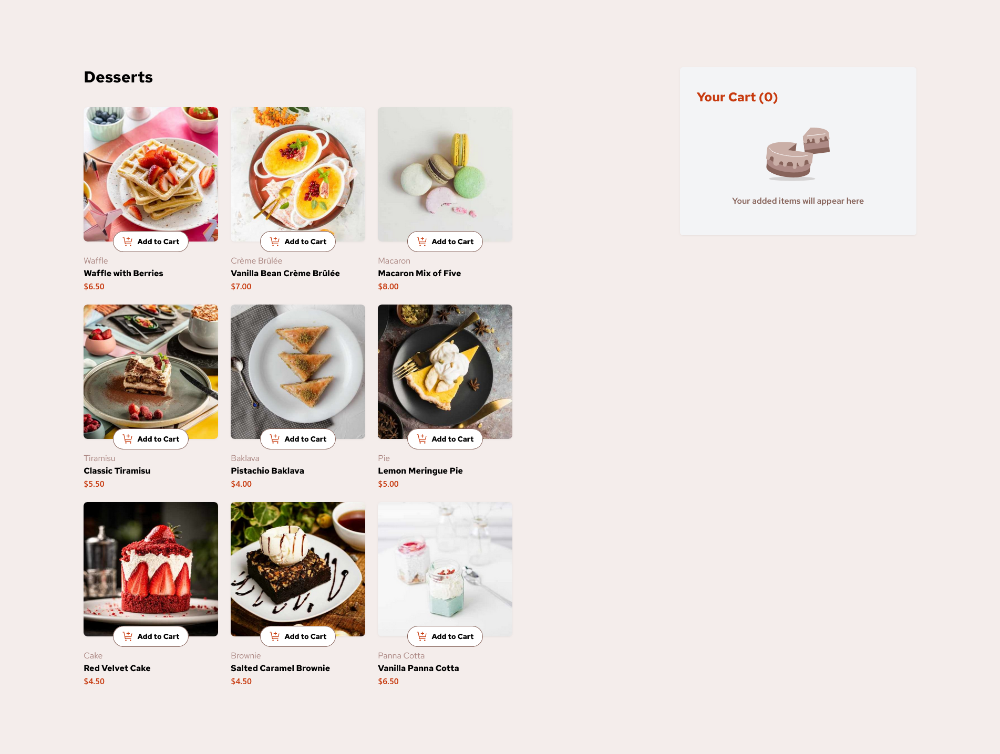

# Frontend Mentor - Product List with Cart Solution

This is my solution to the [Product List with Cart Challenge on Frontend Mentor](https://www.frontendmentor.io/challenges/product-list-with-cart-5MmqLVAp_d). This project helped me enhance my skills in React, responsive design, and state management.

## Table of Contents

- [Overview](#overview)
  - [The Challenge](#the-challenge)
  - [Screenshot](#screenshot)
  - [Links](#links)
- [My Process](#my-process)
  - [Built With](#built-with)
  - [What I Learned](#what-i-learned)
  - [Continued Development](#continued-development)
- [Author](#author)
- [Acknowledgments](#acknowledgments)

## Overview

### The Challenge

Users should be able to:

- Add items to the cart and remove them
- Increase/decrease the number of items in the cart
- See an order confirmation modal when they click "Confirm Order"
- Reset their selections when they click "Start New Order"
- View the optimal layout for the interface depending on their device's screen size
- See hover and focus states for all interactive elements on the page

### Screenshot



### Links

- Solution URL: [Github](https://github.com/fedibbm/product-list-with-cart-main)
- Live Site URL: [Your Live Site URL](https://your-live-site-url.com)

## My Process

### Built With

- Semantic HTML5 markup
- Tailwind CSS for styling
- Flexbox and Grid for layout
- Mobile-first workflow
- [React](https://reactjs.org/) - JS library

### What I Learned

This project provided a deep dive into managing state across components and ensuring a seamless user experience with a dynamic cart system. I also refined my skills in creating responsive layouts using Tailwind CSS and React's component-based architecture.

Here’s an example of managing state in the cart system:

```js
const addProduct = (Item) => {
    const productIndex = cartItems.findIndex(f => f.product.name === Item.product.name);
    if (productIndex === -1 && Item.Qt > 0) {
        setCartItems(prevItems => [...prevItems, Item]);
    } else {
        setCartItems(prevItems =>
            prevItems.map((i, index) =>
                index === productIndex ? Item : i
            ).filter(i => i.Qt > 0)
        );
    }
};

```
This function checks whether the product already exists in the cart and updates the quantity accordingly, ensuring that the cart always reflects the correct number of items.

### Continued development

In future projects, I want to explore more advanced state management techniques, like using Redux for larger applications. Additionally, I plan to further enhance my skills in creating custom hooks in React and improving the performance of React applications by optimizing component rendering.


## Author

- GitHub - [fedibbm](https://www.github.com/fedibbm)
- Frontend Mentor - [@fedibbm](https://www.frontendmentor.io/profile/fedibbm)


## Acknowledgments
I would like to thank the Frontend Mentor for giving me somewhere to practice and better myself as a Frontend developer and anyone who ever posted on stack overflow because i got help from there too (i forgot to save links :/).


